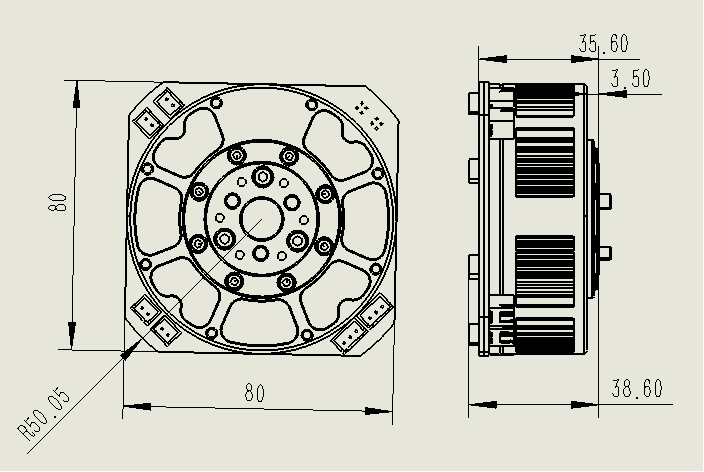
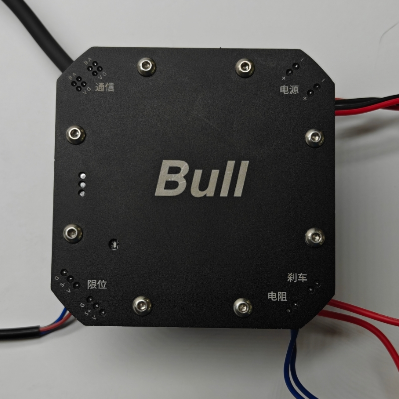

# DBD-Bull

## 目录
- [关于Bull](#关于bull)
- [产品特性](#产品特性)
- [技术参数](#技术参数)
- [尺寸图](#尺寸图)
- [3D模型](#3d模型)
- [接口说明](#接口说明)
- [软件支持](#软件支持)
- [视频教程](#视频教程)
- [关于DBD](#关于dbd)

## 关于Bull

Bull是DBD团队开发的一款**行星减速直流无刷伺服电机**，具有超级紧凑的设计和丰富的接口配置。

### 核心优势
- 🔧 **超紧凑设计** - 体积小巧，适合空间受限的应用场景
- ⚡ **多接口配置** - 双供电、双通信、双限位、泄流电阻及刹车接口
- 🎯 **高精度控制** - 行星减速器提供精确的位置控制
- 🛡️ **稳定可靠** - 工业级设计，确保长期稳定运行

## 产品特性

- ✅ **体积小** - 紧凑设计，节省安装空间
- ✅ **扭力大** - 高扭矩输出，满足重载应用
- ✅ **接口丰富** - 多种接口配置，适应不同应用需求
- ✅ **电压稳定** - 稳定的24V工作电压
- ✅ **刹车功能** - 内置刹车接口，确保安全停止

## 技术参数

| 参数 | 数值 | 单位 |
|------|------|------|
| 工作电压 | 24 | V |
| 额定扭矩 | 5 | Nm |
| 峰值扭矩 | 11 | Nm |
| 最大输出转速 | 120 | rpm |

## 尺寸图

## 3D模型
下载链接：[Bull 3D模型](https://share.feijipan.com/s/xhOnvrpF)

## 接口说明

详细的接口说明请参考上图，包含所有电源、通信、限位和刹车接口的定义。

## 软件支持

### 🖥️ 上位机软件

专业的Bull电机控制软件，提供直观的图形界面和丰富的控制功能。

**功能特性：**
- 实时参数监控
- 多种控制模式
- 参数配置和调试
- 数据记录和分析

📥 **下载链接：** [Bull上位机软件](https://share.feijipan.com/s/xhOnvrpF)

### 🐍 Python SDK

> 🚧 **开发中** - Python SDK即将发布，敬请期待！

**计划功能：**
- 简单易用的API接口
- 完整的文档和示例
- 跨平台支持
- 实时控制和监控

## 视频教程

### 📺 基础教程

| 教程内容 | 视频链接 | 描述 |
|----------|----------|------|
| 接口介绍 | [🎬 观看视频](https://www.bilibili.com/video/BV1AuetzDE7E/) | 详细介绍Bull电机的各个接口功能 |
| 通电及上位机介绍 | [🎬 观看视频](https://www.bilibili.com/video/BV1Jee4zyEUx/) | 电机通电步骤和上位机软件使用 |
| 回零模式介绍 | [🎬 观看视频](https://www.bilibili.com/video/BV1Fee4zyE5R/) | 回零模式的配置和使用方法 |
| 位置模式介绍 | [🎬 观看视频](https://www.bilibili.com/video/BV1Fee4zyE2j/) | 位置控制模式的详细说明 |
| Bull电机测试 | [🎬 观看视频](https://www.bilibili.com/video/BV1WMQ9YZE7c) | 实际测试演示和性能展示 |

## 关于DBD

**DBD (Dynamic Brushless Drive)** 是一家专注于创新矩阵运动技术的新兴制造商。作为电机驱动器、控制器和系统的制造商和开发商，DBD在技术设计中始终强调**性能、效率、可靠性、安全性和简洁性**。

---

